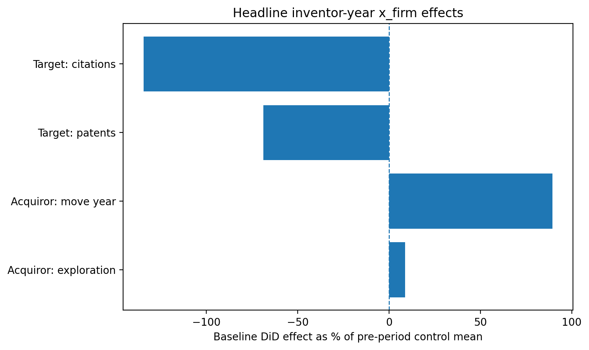
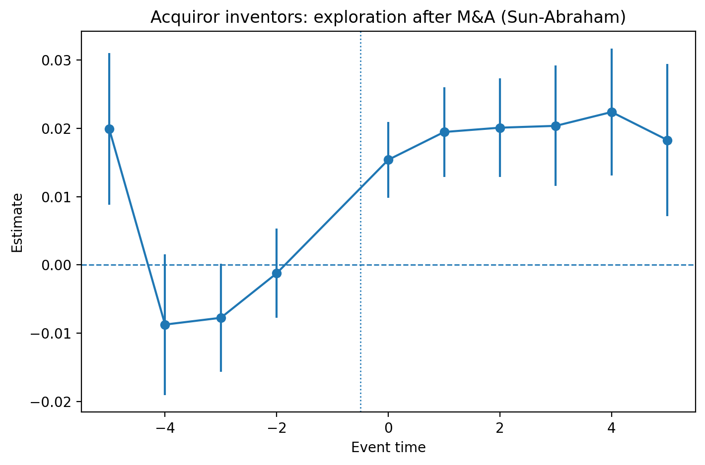
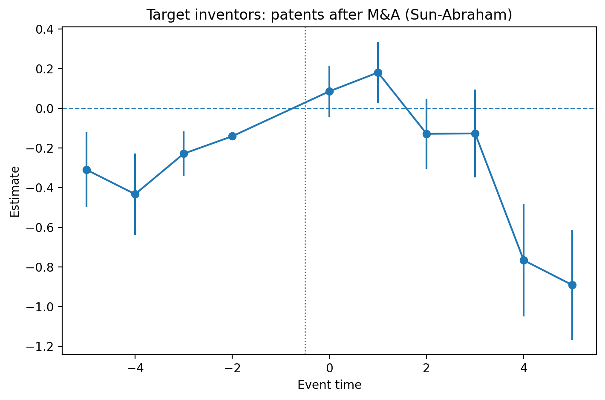

# M&A and Innovation

This repository contains cleaned code and documentation for a research project on how mergers and acquisitions affect inventor mobility, research direction, and innovation output.

## What this project does

The project builds linked firm–inventor event-study panels around M&A deals and studies post-merger outcomes at two levels:

- **Firm panel:** patenting, citations, novelty, exploration/exploitation, and inventor inflows/outflows
- **Inventor-year panel:** patenting, citations, novelty, exploration/exploitation, and move probability

The empirical design combines matched event-study panels with two-way fixed effects, dynamic event studies, heterogeneity analyses, placebo checks, and selected staggered-timing estimators.

## Construction in brief

The construction pipeline links patents, inventors, public firms, and M&A deals into reusable analysis panels. In practice, the repository builds:

- a **firm-year M&A event-study panel**
- an **inventor-year M&A event-study panel**
- merged **lagged firm controls** used in richer inventor specifications

The repository does **not** include the confidential raw or linked data needed to reproduce the full pipeline end to end.

## Main findings in brief

The notebook’s headline takeaway is not simply “M&A hurts innovation” or “M&A helps innovation.” The results are more structured:

- **At the firm level,** target firms show the clearest evidence of post-merger declines in innovation outcomes, while acquiror-side effects are more mixed and often look like reallocation rather than broad productivity gains.
- **At the inventor-year level,** target inventors show the most durable productivity losses, especially in patents and citations.
- **For acquiror inventors,** the strongest recurring effects are increased exploration and short-run mobility, which fits a reorganization/search-reorientation story more than a clean improvement in inventor productivity.
- **Heterogeneity matters:** effects vary by inventor position within the firm and by firm size, which suggests mechanism rather than a single average treatment effect.

These results should be read with appropriate caution. The repository includes placebo tests and alternative estimators precisely because identification is demanding in staggered M&A settings.

## Suggested figures

**Headline inventor-year x_firm effects**

**Acquiror inventors: exploration after M&A (Sun-Abraham)**

**Target inventors: patents after M&A (Sun-Abraham)**

## Repository structure

- `src/` cleaned scripts
- `notebooks/` reproducible notebooks
- `docs/` design notes and project documentation
- `figures/` selected figures
- `tables/` selected tables
- `data/` placeholder folders only; confidential data are not included

## Construction code

The main data-construction pipeline lives in `src/construction/`.

Suggested entry points:
- `src/construction/run_construction.py` — orchestrator and execution order guide
- `src/construction/pipeline_reference.py` — near-faithful single-file reference version of the original construction script, with the unused standalone inventor move panel section removed
- `src/construction/sections/` — equivalent logic split across topical modules for easier navigation

## Analysis code

The cleaned analysis pipeline lives in `src/analysis/`.

Suggested entry points:
- `src/analysis/run_analysis.py` — repository-level orchestrator for the two main analysis branches
- `src/analysis/run_firm_panel_analysis.py` — firm-panel baseline, heterogeneity, advanced methods, and placebo workflow
- `src/analysis/run_inventor_year_analysis.py` — inventor-year baseline, heterogeneity, and selected advanced workflow
- `src/analysis/pipeline_reference.py` — short guide to the cleaned analysis split
- `src/analysis/sections/` — topical modules for firm analysis, inventor-year analysis, advanced methods, placebo routines, and shared utilities

## Notes for public use

The repository does not include the confidential raw and linked data required to run the full pipeline end to end. Path configuration, source file names, and cache/output targets should be adapted locally in the configuration files.
