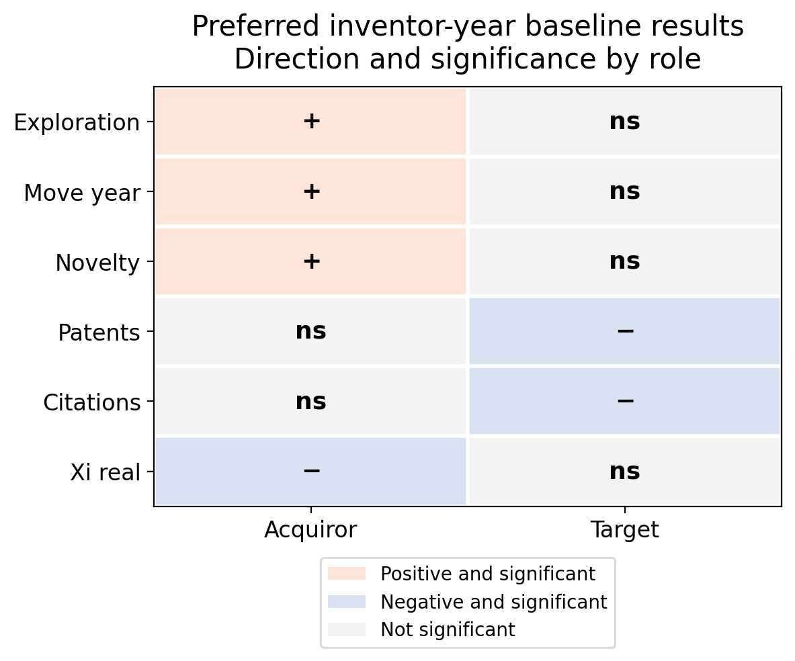
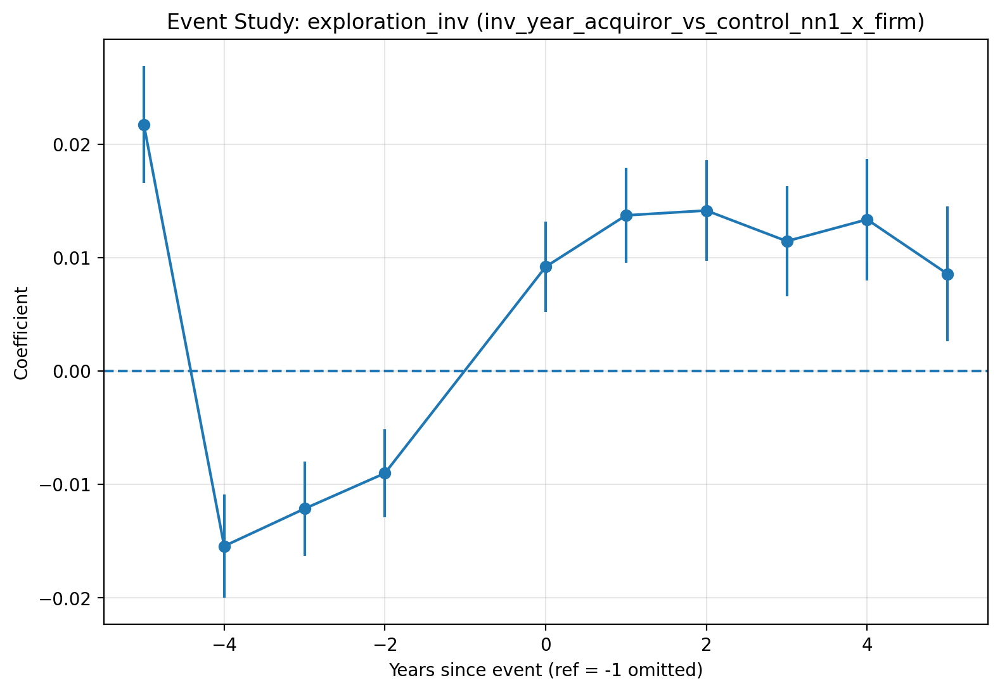
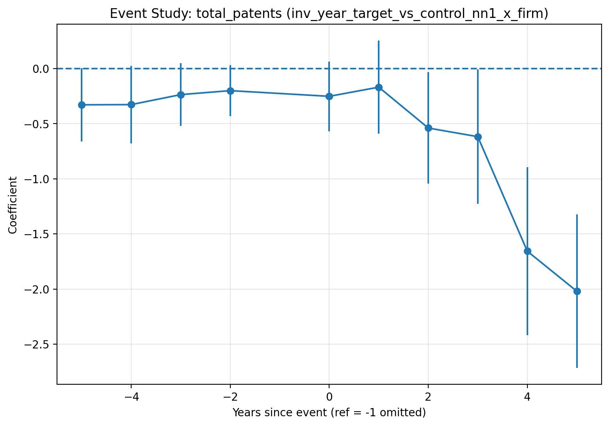

# M&A, Inventor Mobility, and Innovation

This is an applied econometrics project that asks how mergers and acquisitions reshape inventive labor, research direction, and innovation output.  The project combines patent records, inventor histories, public-firm fundamentals, and M&A events into matched event-study panels.

The repository is intended as a public research portfolio: it emphasizes transparent construction logic, interpretable causal designs, and a concise set of curated results.  The confidential raw and linked datasets required to rebuild the full panels for the analysis are **not included**.

## Research question

Do M&A events change where inventors work, what they invent, and how much firms innovate?

To answer this question, the analysis separates inventors by whether they were associated with acquirors or targets in M&A events, and studies outcomes including patenting, citations, novelty, exploration versus exploitation, inventor mobility, inventor inflows/outflows, and firm-level innovation output.

## Main takeaway

Baseline DiD, dynamic event studies, staggered-treatment estimators, placebo checks, and heterogeneity analyses provide complementary evidence and suggest that M&A changes the **organization of inventive labor**.

- **Acquiror inventors** show the clearest evidence of reorientation:  exploration rises, mobility increases around the event window, and heterogeneity results suggest effects differ by inventor position within the firm.
- **Target inventors** show a more disruptive pattern:  baseline estimates point to lower patenting and citations, although dynamic estimates are less clean because target-side innovation paths show persistent pre-period gaps to control units and movements already before acquisition.
- **Firm-level results** provide useful aggregate context, especially for target-side declines in innovation output, but placebo and timing diagnostics suggest they should be read mostly as supporting evidence.

## Selected evidence

### Preferred inventor-year evidence map

The preferred inventor-year specification combines matched control units, inventor-level controls, and lagged firm controls.  The summary figure confirms the main directional patterns: acquiror-side effects are strongest for exploration, novelty, and mobility, while target-side effects are more negative for patenting and citations.



### Acquiror inventors: exploration after M&A

Acquiror inventors show the most consistent evidence of innovation reorientation.  The dynamic event-study path for exploration does not show a sharp break exactly at the event year, but post-event exploration is persistently higher, consistent with M&A changing the direction of inventive activity.



### Target inventors: productivity disruption

Target inventors show more disruptive productivity patterns, especially in overall patenting.   The event study is not a textbook clean design because treated target inventors already differ from matched controls before acquisition; however, the pre-period coefficients are relatively stable rather than clearly deteriorating.  This points more to a persistent pre-treatment level gap, or sensitivity to the omitted `k=-1` reference period, than to a sharply worsening pre-trend.



## Empirical design

The project estimates effects separately for inventors working for acquirors and targets using matched event-study panels.  The baseline specifications compare treated units to matched controls before and after the M&A event, with unit and year fixed effects and, in richer specifications, lagged firm and inventor controls.  

The analysis includes several complementary estimations:

| Component | Role in the project |
|---|---|
| Matched event-study panels | Build more comparable treated and control units before estimation. |
| Two-way fixed-effects DiD | Estimate average post-M&A differences conditional on unit and year fixed effects. |
| Dynamic event studies | Show timing, persistence, and pre-trend diagnostics. |
| Sun-Abraham / CSDID / BJS | Address staggered-treatment and cohort-timing concerns. |
| Synthetic control | Provide firm-level counterfactual paths for selected outcomes. |
| Causal forest and triple-DiD | Explore heterogeneity by firm size, deal scale, and inventor position. |
| Placebo tests | Test whether the design produces effects under shifted or randomized treatment timing. |

## Repository guide

The public overview notebook provides a detailed walkthrough of the project.  For the most readable version of the documentation, start with the rendered project page:

- [Rendered project page](https://fresearch99.github.io/manda_innovation/)
- [`notebooks/01_manda_innovation_overview.ipynb`](notebooks/01_manda_innovation_overview.ipynb)
- [`notebooks/01_manda_innovation_overview.html`](notebooks/01_manda_innovation_overview.html)
- [`notebooks/01_manda_innovation_overview.pdf`](notebooks/01_manda_innovation_overview.pdf)


Repository structure:

```text
manda_innovation/
├── data/          # placeholders only; confidential data are excluded
├── docs/          # design notes and project documentation
├── figures/       # curated public figures used by the notebook and README
├── notebooks/     # public overview notebook in ipynb/html/pdf form
├── outputs/       # placeholder for generated outputs
├── src/
│   ├── analysis/      # cleaned analysis pipeline
│   └── construction/  # cleaned data-construction pipeline
└── README.md
```

Main code entry points:

- `src/construction/run_construction.py` — construction orchestrator.
- `src/analysis/run_analysis.py` — top-level analysis orchestrator.
- `src/analysis/run_firm_panel_analysis.py` — firm-panel analysis workflow.
- `src/analysis/run_inventor_year_analysis.py` — inventor-year analysis workflow.

## Technical requirements

The code is written for a Python/Jupyter research workflow.  Core packages include:

```text
pandas
numpy
matplotlib
statsmodels
linearmodels
scikit-learn
```

Selected advanced analyses additionally use:

```text
econml
csdid
SyntheticControlMethods
```

A typical local setup is:

```bash
git clone git@github.com:Fresearch99/manda_innovation.git
cd manda_innovation
python -m venv .venv
source .venv/bin/activate
pip install pandas numpy matplotlib statsmodels linearmodels scikit-learn jupyter
```

Optional advanced-method dependencies can be installed as needed:

```bash
pip install econml csdid SyntheticControlMethods
```

Because the underlying patent, inventor, public-firm, and M&A data are not public in this repository, the full construction and analysis pipelines require local path configurations and access to the excluded source files.  Path and output configurations are handled in `src/analysis/config.py` and `src/construction/01_setup_helpers.py`.

## Public-use note

This is a code, design, and documentation release rather than a fully self-contained replication package.  The repository is intended to make the research workflow, empirical design, estimator choices, and selected outputs accessible to researchers and interested users without exposing confidential linked data.