# The Impact of M&A on Inventor Mobility and Innovation

## A. Overview of the GitHub package

This notebook is a companion to the construction and analysis pipeline in the repository.  It explains how the data are built and how the main empirical designs work, presents a headline story, and distinguishes robust findings from fragile or method-dependent ones.

The GitHub version of the project separates the work into:

- **construction scripts**: build cleaned firm-year and inventor-year panels,
- **analysis scripts**: baseline DiD, event studies, heterogeneity, and advanced estimators,
- **output structure**: local regression tables, coefficient plots, and summary CSVs, with only curated figures committed publicly,

### Main empirical findings story

M&A appears to reorganize innovation.  Acquiror inventors are reoriented toward exploration around the deal window, with mobility patterns consistent with short-run reassignment rather than a persistent mobility increase.  Target-side and firm-level outcomes show substantial disruption and innovation output decline, but their event-study paths also reveal pre-period movement and the results are more fragile across methods, so those results should be interpreted more cautiously as disruption and selection evidence rather than clean causal evidence.


### Construction summary

The data construction for the project is intended to provide users and researchers with a useful guide on how to work with inventor-level innovation data.  The project starts from raw patent, accounting, and deal records and builds a linked set of firm-level and inventor-level panels that can speak to both firm- and inventor-level outcomes around M&A events.  In the completed construction run, the inventor M&A event-study panel is fully balanced over the `[-5, +5]` window, with stable treated and control row counts at each relative year.  Treated inventors are also matched to control units with reasonably good pre-period balance at `t = -1`. 


## B. Construction

### Overview and design logic

A major part of the value of this project is the construction itself.  It combines different data sources which provide useful information into usable research datasets:

- **PatentsView** provides patent, inventor, assignee, location, CPC, and citation information.
- **External patent-quality data** add KPSS-based measures such as `xi_real` and citation fields.
- **Compustat** provides firm fundamentals.
- **WRDS link tables** connect Compustat firms to CRSP/market identifiers such as `permco`.
- **SDC M&A data** provide acquisition and target events.

### Construction pipeline at a glance

The construction code is organized into eight sequential modules plus one runner script.

| File | Main purpose | Main outputs |
|---|---|---|
| `run_construction.py` | Executes all construction modules in order | End-to-end pipeline |
| `01_setup_helpers.py` | Paths, imports, global helpers, data download helper | Shared environment |
| `02_patent_panel_construction.py` | Builds the core patent-inventor-firm dataset and patent-level measures | `pat_inv_firm_df.pkl` and intermediate patent objects |
| `03_exploration_exploitation.py` | Adds exploration/exploitation metrics | enriched patent-inventor-firm file |
| `04_mobility_and_mover_metrics.py` | Detects inventor moves and builds move-related performance objects | mover event and move-performance files |
| `05_technology_similarity.py` | Computes technology proximity and rolling similarity measures | event-based and rolling similarity outputs |
| `06_firm_fundamentals.py` | Builds Compustat-based firm fundamentals and links them to `permco` | linked Compustat panel |
| `07_linking_and_manda.py` | Cleans and links M&A deals and adds pre-deal technology similarity | `manda.pkl` |
| `08_final_panels.py` | Produces the final firm-year, firm-event, inventor-year, and inventor-event panels | final analysis panels |


### Step 0. Environment, paths, and helper infrastructure

The setup module does four jobs:

1. loads the core Python stack,
2. defines the project paths,
3. validates that required local inputs exist,
4. provides a helper to download PatentsView files on demand.

#### Main libraries used

The construction is fundamentally a Python data engineering and empirical research pipeline.  The main tools are:

- **pandas** and **NumPy** for table manipulation and vectorized operations,
- **scikit-learn** for matching support and nearest-neighbor logic,
- **tqdm** for progress monitoring in long-running loops,
- **requests** and **zipfile** for downloading and unpacking PatentsView files,
- **collections.Counter / defaultdict / deque** for efficient rolling technology-history objects.


The project also depends on several local raw-data directories, thus the setup code defines a strict path check, to avoid the code failing after several hours of runtime:

```python
def assert_required_paths_exist():
    required_paths = [
        BASE_PROJECT_PATH,
        RAW_DATA_PATH,
        FINANCIAL_DATA_PATH,
        MANDA_DATA_PATH,
        LINKTABLE_CSV,
    ]
    for path in required_paths:
        if not os.path.exists(path):
            raise FileNotFoundError(f"Required path does not exist: {path}")
```


### Step 1. Build the core patent-inventor-firm dataset

 Every dataset constructed in later steps depends on a clean patent-level file that links:

- a patent,
- its inventor(s),
- the public firm to which it can be assigned,
- the patent's technological and quality characteristics.


#### Raw patent inputs

The construction draws the following core tables from PatentsView:

- inventor-patent links,
- assignee-patent links,
- inventor locations,
- CPC technology classifications,
- patent-to-patent citations,
- patent issue dates,
- application filing dates.

The code begins with a cache-first wrapper, so the core patent datasets are only loaded from PatentsView if they are not already stored locally:


#### Cleaning 

Several cleaning steps are important to construct meaningful data.

- **Keep business assignees and the primary assignee**
    The assignee file is filtered to:

    ```python
    assignee_df = assignee_df[
        (assignee_df['assignee_type'] == 2) &
        (assignee_df['assignee_sequence'] == 0)
    ].copy()
    ```

    This means the construction is intentionally focused on the primary business assignee rather than all possible assignee relationships.  The downstream goal is to connect patents to publicly listed firms in a way that is stable enough for event-study analysis and avoid processing of large numbers of patent data that can be excluded early on.

- **Use filing year rather than issue year**
    The code merges issue dates and application dates and defines filing year.  Filing dates are closer to the time of the actual inventing than grant dates, which can be delayed by the examination processes.

- **Retain detailed CPC information**
    The code keeps CPC subclasses and groups, using primary CPC assignments for some tasks and full CPC combinations for novelty construction later.


#### External data merge

Two external research datasets are merged with the patent data.

- **KPSS patent-quality data**
    The construction merges to the PatentsView data patent-level innovation value `xi`, citation information, and links to `permco` firm identifiers from the replication dataset of [Kogan, Papanikolaou, Seru, and Stoffman (2017) (KPSS)](https://github.com/KPSS2017/Technological-Innovation-Resource-Allocation-and-Growth-Extended-Data).  KPSS data are quickly becoming a standard data source for innovation research and allow the project to easily identify patents assigned to publicly-listed companies.

- **State-level noncompete enforceability**
    The code merges the state-year noncompete enforcement score from [Johnson, Lavetti and Lipsitz (2024)](https://dataverse.harvard.edu/dataset.xhtml?persistentId=doi:10.7910/DVN/37A0L2) using inventor state and filing year from PatentsView.  The project is about inventor mobility, so including a local legal environment relevant to mobility is economically meaningful.


#### Patent-level quality measures

The construction builds several patent-quality measures, which are all well established in the innovation literature.

- **Forward citations**
    First, unconditional forward citations are computed from citation data.  Then the code constructs class-year normalized bins based on CPC subclass and filing year:

    ```python
    stats = df.groupby(['filing_year', 'cpc_subclass'])['forward_citations']           .quantile([0.90, 0.99]).unstack()
    ```

    Raw citations are noisy across technology classes and cohorts.  Ranking patents within technology-year cells makes the quality proxy more comparable.


- **KPSS-based citation bins**
    The same binning logic is repeated for the KPSS citations, reducing the dependence on a single citation measure from PatentsView.

- **Patent novelty**
    The novelty measure is based on new combinations of CPC classes, following the logic of recombinatorial innovation.  The key idea is the following:

    - represent a patent as a set of technology classes,
    - enumerate all within-patent class pairs,
    - identify whether each pair is new in the historical record,
    - summarize the share of new combinations.

    The number of new combinations of patent classes measures whether the patent creates knowledge that combines different technology fields in a novel way relative to prior art.

- **Citation-link measures**
    The pipeline also builds:

    - backward citations,
    - self-citations at the firm level.

    Backward citations help to measure if an invention is in a more mature technological area (requiring more prior art to be cited), and self-citations measure whether firms explore new technological areas or focus on developing in their previous areas of expertise.  


#### Final patent-inventor-firm object

After all merges, the project creates the core patent-level research dataset `pat_inv_firm_df` and then adds inventor career features such as:

- first filing year,
- first CPC field,
- inventor age measured as years since first filing,
- indicators for whether a patent stays close to the inventor's original field, i.e., the first CPC field.

Thus, we have a single micro-level innovation dataset from which the downstream panels can be constructed.


### Step 2. Construct exploration and exploitation measures

For each patent, the code builds the set of CPC subclasses and compares that set to the recent knowledge base of:

- the patent's inventors,
- the firm the patent is assigned to.

The knowledge base is defined using a rolling five-year window.  We can then define technology exploration as the share of CPC subclasses that do not appear in the inventor’s or firm’s recent patenting history

A simplified version of the logic is:

```python
for row in patent_level.itertuples(index=False):
    inv_knowledge = union_of_recent_cpcs_for_inventors
    firm_knowledge = union_of_recent_cpcs_for_firms

    exp_inv = 1 - overlap(current_cpcs, inv_knowledge) / len(current_cpcs)
    exp_firm = 1 - overlap(current_cpcs, firm_knowledge) / len(current_cpcs)
```

A patent is thus classified as more exploratory when it uses CPC classes that are less represented in the inventor's or firm's recent history.  This is an intuitive way to measure movement into less familiar technologies, which could be a reasonable effect following an acquisition as, for example, inventor teams are combined or firms change innovation focus.  The key intuition is that mergers may reshape what inventors and firms work on even when the total number of patents does not change much.


### Step 3. Identify inventor mobility events and build performance metrics around moves

The definition of an inventor move is intentionally conservative.  Patent assignment data can be noisy.  A single assignee switch may reflect legal assignment timing, joint work, or temporary data noise rather than a real labor-market transition.  Thus, the code first restricts attention to inventors with at least five patents and defines a move only when there is a stable sequence of firm assignees around the transition:

- two patents before the move at the old firm,
- the first patent at the new firm,
- two subsequent patents at the new firm.

The core rule is:

```python
is_move = (
    (career_df['permco'] != career_df['prev_permco']) &
    (career_df['prev2_permco'] == career_df['prev_permco']) &
    (career_df['next_permco'] == career_df['permco']) &
    (career_df['next2_permco'] == career_df['next_permco'])
)
```

#### Pre/post mover performance

Once inventor moves are defined, the code builds five-year pre-move and post-move performance windows and aggregates inventor outcomes such as:

- patent counts,
- citations,
- `xi_real`,
- novelty,
- backward and self-citations,
- exploration and exploitation,
- team size.


The project then compares movers to peers at origin and destination firms.  This helps to distinguish, for example, whether firms are losing unusually important inventors in mobility events and whether incoming inventors are more or less productive than incumbent peers.


### Step 4. Measure technology similarity around moves and deals

The project next constructs technology-similarity measures that help interpret whether mobility and M&A events affect the technological similarity of firms and inventors.

First, the code constructs technology vectors before and after a move for:

- the inventor,
- the origin firm,
- the destination firm.

Vectors are represented as `Counter` objects over the CPC subclasses of patents filed in the five years before and after the move.  Similarity itself is then measured with cosine similarity.  This allows us to measure:

- inventor pre/post self-similarity,
- inventor similarity to origin firm,
- inventor similarity to destination firm,
- origin-destination firm similarity.


As a second step, the routine also creates a rolling annual similarity measure, comparing a current year's technology vector with the preceding five-year technology history for firms and inventors that experienced at least one move in their career.  This turns technology similarity into a panel variable rather than a one-time event summary, allowing us to analyze how the innovation direction of firms and inventors changes over time.


### Step 5. Build firm fundamentals from Compustat

This module constructs the firm-level economic state variables needed to control for confounding firm conditions and define heterogeneity splits.

As a first step, the code filters Compustat to a standard industrial sample:

- excludes financials, utilities, and public sector entities,
- keeps standardized, consolidated, domestic statements,
- removes clearly invalid negative values for core accounting variables.

It then defines the analysis year as:

- same calendar year if the fiscal year ends in June to December,
- previous calendar year otherwise.

That aligns fiscal records more closely with the calendar year to which they economically belong.


The module then constructs a broad set of variables, including:

- size: `log_at`, `log_sale`, `log_mv`,
- profitability: `roa`, margins, operating profitability,
- growth and valuation: `sale_growth`, `tobinsq`, `market_to_book`,
- financing and liquidity: leverage, cash, interest coverage,
- investment: capital expenditures, R&D intensity, intangible assets,
- payout and repurchases,
- financial constraints indices such as **Whited-Wu** and **Hadlock-Pierce**.


Finally, the firm-level Compustat data are linked to the patent data using the CRSP-Compustat link table and the `permco` identifier, which KPSS use as their main firm-level identifier.  


### Step 6. Clean M&A deals

The M&A module transforms raw SDC transaction records into a deal panel that can be merged into firm-year and inventor-year data.

Several design choices are worth highlighting:
- The project uses the announcement year as `t=0` for the event-study setup.  Announcements are typically the point at which firms, investors, and employees expect that the merger will complete and innovation behavior adjusts.
-  The code keeps only completed and withdrawn deals and explicitly creates a failed-merger indicator.  Failed deals can later be used either as controls, robustness checks, or for identification.

The M&A panel retains the following variables:

- acquiror and target identifiers,
- transaction value,
- ownership percentages,
- indicators based on acquiror and target industry codes for whether the deal was diversifying,
- deal outcome and failure status,
- pre-deal technology similarity, built from five-year patent portfolios of the target and acquiror.


### Step 7. Assemble the final analysis panels

The final module combines the constructed datasets into four analysis-ready panels.


#### 7.1 Firm-year panel

The code first aggregates patent outcomes to the `permco × year`, i.e., the firm-year level:

```python
firm_year_patent_metrics = pat_inv_firm_df.groupby(['permco', 'filing_year']).agg(
    total_patents=('patent_id', 'nunique'),
    cites=('cites', 'sum'),
    xi_real=('xi_real', 'sum'),
    ...
).reset_index()
```

It then merges in:

- rolling firm technology similarity,
- Compustat fundamentals,
- inventor arrival and departure counts,
- relative quality measures of arriving and departing inventors,
- M&A event counts and deal-value measures.


#### 7.2 Firm-year M&A event-study panel

The next object is a firm-year event-study panel centered on the closest deal year within a ±5-year window.  For each firm-year, the construction identifies the nearest prior or future M&A announcement involving that firm as either acquiror or target, assigns the corresponding deal characteristics, computes event time as `data_year - closest_deal_year`, and sets the M&A variables to missing if the closest deal is more than five years away.


#### 7.3 Inventor-year panel

The inventor-year panel is built for inventors who have filed at least one patent with a firm in the analysis universe.  The code creates:

- annual inventor outcome measures,
- zero-filled years for no-patenting observations within the inventor career span, i.e., between the first and last observed filing year,
- annual employer assignment, based on the modal firm to which the inventor’s patents are assigned,
- move-year indicators, set to one if the inventor is observed moving from one firm to another,
- M&A context of the assigned employer, i.e., the employer’s firm-year M&A event-study variables defined above.


#### 7.4 Inventor-event panel with matched controls

The final dataset constructed is the inventor M&A event-study panel.

The logic is:

1. identify treated inventor-deal events in which the assigned employer has an M&A event within a `[-5, +5]` window,
2. keep only inventor-deal events for which the inventor is observed over the full event window,
3. construct a control set by matching never-treated inventors to treated inventors using inventor characteristics measured at `t = -1`,
4. expand both treated events and matched control pseudo-events into a balanced `[-5, +5]` relative-year grid,
5. merge annual inventor outcomes back onto the event grid.

Matching is implemented using pre-event inventor characteristics such as inventor age, cumulative patents, cumulative citations, and first CPC subclass.  In the main construction, controls are selected using propensity-score distance with exact matching on first CPC subclass when available.  The resulting panel is balanced at the inventor-event level, with each retained treated or control event having one row for each relative year from `-5` to `+5`.

#### Construction diagnostics

The completed construction run also produces useful diagnostics for the inventor M&A event-study panel.  
  
The inventor event-study panel is balanced by construction for each inventor-event over the full `[-5, +5]` window.  At `t = -1`, the matched treated and control groups are reasonably close on the main inventor characteristics used for matching and interpretation:

- `inventor_age`: treated = **10.531**, control = **9.952**, SMD = **0.098**
- `cum_patents`: treated = **9.776**, control = **7.631**, SMD = **0.144**
- `cum_cites`: treated = **346.441**, control = **197.801**, SMD = **0.129**

The overall picture is encouraging rather than perfect.  Standardized mean differences (SMDs) around `0.09` to `0.14` indicate that the matching substantially improves comparability, but does not eliminate all pre-existing differences between treated inventors and controls.  In particular, treated inventors remain somewhat more productive and older than controls.  That is not surprising, as larger firms are typically more established, employ more productive inventors, and are also more likely to engage in M&A activity.  

The diagnostics also show substantial reuse of matched controls:

- unique control-event matches, i.e., the number of distinct matched control pseudo-events: **487,373**
- share of matched control inventors reused more than once: **0.779**
- maximum reuse count, i.e., the largest number of treated inventor-events matched to the same control inventor: **132**

It is common for nearest-neighbor matching in a large treated-event sample to reuse certain control units more frequently, especially when treated units are on average older, show higher cumulative productivity, and work in specific technological areas.  Some control inventors are simply very attractive matches for many treated events.

For the empirical analysis, the reuse of control units effectively reduces the independent variation in the control group.  In practical terms, this does not invalidate the design, but it means that inference should account for dependence across observations and the matched-control evidence should be interpreted cautiously.


## C. Analysis: method inventory, headline evidence, and interpretation

The analysis asks whether M&A changes innovation outcomes, inventor mobility, or innovation direction.  The headline results suggest that M&A changes the organization of inventive labor.  Acquiror inventors show evidence of reorientation, with more exploration and greater mobility.  Target inventors show a more disruptive pattern: baseline estimates point to lower patenting and citations, while some dynamic estimates are less stable and should be interpreted cautiously.

#### Note on visualization

Most figures in this notebook are already produced by the analysis scripts under `Model_outputs/Plots`; stacked synthetic-control plots are written under `Model_outputs/advanced`.  To render the notebook without changing the analysis code, copy or sync those plots into the repository-level `../figures/` folder while preserving subfolders.

```bash
rsync -av "$MODEL_OUTPUTS/Plots/" "../figures/"
rsync -av "$MODEL_OUTPUTS/advanced/" "../figures/advanced/"
```

The analysis sections below include the most useful figure slots.  If a linked figure does not render yet, it means the corresponding PNG has not been copied into `../figures/` or has not yet been generated by the analysis run.

### 1. Baseline empirical design

The core specification for the baseline model is a two-way fixed-effects DiD model estimated separately for acquiror and target events:

$$
Y_{it} = \beta \cdot \text{PostTreat}_{it} + X_{it-1}'\delta + \alpha_i + \lambda_t + \varepsilon_{it}.
$$

Here $Y_{it}$ is an inventor-year or firm-year outcome, $\alpha_i$ absorbs time-invariant unit differences, $\lambda_t$ absorbs common year shocks, and $X_{it-1}$ contains lagged controls where available.  The coefficient $\beta$ is the average post-M&A difference between treated units and matched or comparison controls, conditional on unit and year fixed effects.

The corresponding event-study specification replaces the single post-treatment indicator with relative-year indicators to the deal-year $G_i$:

$$
Y_{it} = \sum_{k \neq -1} \beta_k \cdot 1\{t-G_i=k\}\times \text{Treated}_i + X_{it-1}'\delta + \alpha_i + \lambda_t + \varepsilon_{it}.
$$

The omitted period is $k=-1$, so each $\beta_k$ is interpreted relative to the year immediately before the deal.  The implementation is deliberately compact: the same fixed-effects wrapper is reused across firm and inventor designs.

#### Baseline event-study graphics used throughout

The baseline event-study plots show both identification diagnostics and economic timing.  In each plot, pre-period coefficients should be read as a parallel-trends diagnostic, i.e., whether treated and control units followed similar trends before the merger.  Post-period coefficients show whether the effect is immediate, delayed, persistent, or transitory.

The plotting routine in `firm_analysis.py` saves these figures as:

```text
es_{role_tag}_{outcome}.png
```

For the inventor-year preferred specification, including firm- and inventor-level controls, the key `role_tag` values are:

```text
inv_year_acquiror_vs_control_nn1_x_firm
inv_year_target_vs_control_nn1_x_firm
```

### 2. Why the inventor-year panel is the headline layer

The inventor-year panel directly observes the mechanism that motivated the project: inventor behavior around M&A.  It separates changes in:

- productivity: `total_patents`, `cites`, and `xi_real`,
- search direction: `exploration_inv` and `exploitation_inv`,
- mobility: `is_move_year`,
- novelty: `novelty_score_group`.

The preferred specification is `nn1_x_firm`: nearest-neighbor or propensity-score matched inventor control groups, inventor-level controls, and lagged firm controls.  

The acquiror inventor-year sample is large: **4,105,277 rows**, **119,682 inventors**, and **2,779 firms**.  The target sample is smaller but still substantial: **2,011,394 rows**, **54,729 inventors**, and **2,873 firms**.   


#### Pre-period descriptives and what they imply

The pre-period balance diagnostics show that there are some economically meaningful differences between treated and control units.  Acquiror-side treated inventors are stronger ex ante on productivity and value-weighted innovation measures: they average **0.95 patents per year** versus **0.74** for controls, **28.6 citation-weighted patents per year** versus **16.5**, and an average `xi_real` of about **16.7** versus **6.6**.  Target-side treated inventors are less distinct from controls in patenting levels, with **0.82 patents per year** versus **0.74**, but they are more mobile and somewhat more exploration-oriented: their pre-period move-year incidence is **1.9%** versus **0.9%** for controls, and their exploration share is about **24.1%** versus **21.8%**.  

The love plots below show that these raw differences are substantially attenuated in standardized terms. In the acquiror sample, most standardized mean differences are close to or below the **±0.10** balance benchmark.  The largest remaining imbalance is in `xi_real`, where treated acquiror inventors remain substantially above controls before treatment.  In the target sample, all standardized mean differences remain below the ±0.10 benchmark, with the largest residual differences appearing for move-year incidence, citations, and exploration.  Overall, the matched controls provide a broadly comparable pre-treatment comparison group, but the remaining pre-period differences make the dynamic pre-trend diagnostics especially important for assessing whether the parallel-trends assumption is plausible.

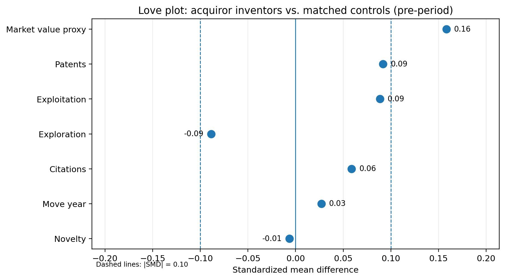

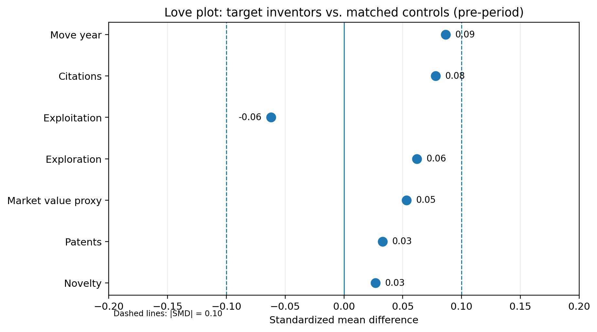


### 3. Headline inventor-year results

The inventor-year baseline results suggest two economically different effects, but the discussion below also makes clear that the interpretation has to be measured.  Acquiror-side inventors, i.e., inventors who were working for the acquiring firm in an M&A transaction, reorient their innovation activity with increased exploration and labor mobility; target-side inventors who work for the acquired firm become less productive but only after some time delay, making the effects less clean.

The evidence map below summarizes the directional results: the acquiror side has significant positive effects for exploration, mobility, and novelty, while the target side has significant negative effects for patents and citations.


#### Acquiror inventors: reorientation, with visible pre-deal adjustment

For acquiror inventors, the preferred `nn1_x_firm` baseline estimates are strongest for search-direction and mobility outcomes:

- `exploration_inv`: **+0.019** with `p < 0.001`,
- `is_move_year`: **+0.008** with `p < 0.001`,
- `novelty_score_group`: **+0.004** with `p < 0.001`,
- `total_patents`: **-0.027** with `p = 0.134`, not significant,
- `cites`: **+2.177** with `p = 0.293`, not significant.

Acquiror inventors appear to be reallocated toward different kinds of inventive work.  The event-study figures support this broad interpretation, but not in a textbook “flat pre-period, sharp post-period jump” form.  The exploration path is V-shaped before the event: it is positive at `k=-5`, negative at `k=-4` to `k=-2`, then positive and persistent after the deal.  This pattern is consistent with reorientation around the deal window, but it also signals pre-deal adjustment or differential trajectories for the acquiror inventors.  However, this is a very cautious interpretation: five years of pre- and post-period observations is a long window, and a shorter window would show cleaner effects.  


The mobility graph suggests short-run reallocations.  It shows a pronounced spike around `k=1`, followed by attenuation and later negative coefficients.  This is still economically useful: the run-up to acquisition and the subsequent integration may trigger short-run reassignment or mobility, followed by stabilization.  But because the pre-period slopes upward toward the event and the later post-period reverses, the mobility pattern is not a clean persistent effect and not consistent with a pre-trend-free identification pattern.

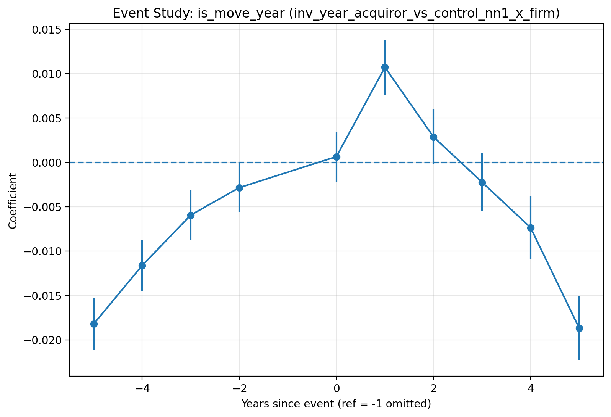


#### Target inventors: severe disruption, but weak dynamic identification

For target inventors, the preferred baseline estimates are more negative on output outcomes:

- `total_patents`: **-0.510** with `p = 0.029`,
- `cites`: **-22.121** with `p = 0.031`,
- `is_move_year`: **-0.012** with `p = 0.076`,
- `exploration_inv`: essentially zero and not significant.

The target inventor total-patents event study shows a severe negative effect in the post period, especially in later years.  But it also shows negative coefficients already throughout the pre-period.  This is exactly the kind of plot that should make us cautious: acquired target inventors may already be on weaker output trajectories before the acquisition.  The target estimates are therefore best framed as disruption or selection evidence around acquired firms, not as clean causal evidence given the delayed effects.


### 4. Dynamic DiD methods

The baseline DiD is useful but incomplete because M&A events occur in different years.  With staggered treatment timing, a simple two-way fixed-effects event study can mix cohorts and comparison groups in ways that are hard to interpret.  The project therefore implements several dynamic estimators that are designed to more explicitly account for staggered treatment.

#### Callaway-Sant'Anna / CSDID

The CSDID estimator focuses on group-time treatment effects:

$$
ATT(g,t) = E[Y_t(1)-Y_t(0) \mid G=g],
$$

where $G=g$ is the cohort first treated in year $g$.  This measures the average treatment effect for cohort $g$ in calendar year $t$, relative to the counterfactual outcome that cohort would have had absent treatment, i.e., the M&A event.  The counterfactual outcome $Y_t(0)$ is estimated by comparing each treated cohort to units that are either not yet treated or never treated in calendar year $t$, using a doubly robust estimator.  The doubly robust CSDID specification estimates the untreated counterfactual by combining an outcome regression with inverse-probability weighting.  It directly adjusts for observed covariates while also reweighting comparison units to resemble the treated cohort.  The estimator is doubly robust in the sense that $ATT(g,t)$ remains consistently estimated if either the outcome model or the treatment-assignment model is correctly specified.

After estimating $ATT(g,t)$, the implementation maps calendar time into event time $e=t-g$ and aggregates effects using cohort-size weights:

$$
\widehat{ATT}(e)
=
\sum_{g \in \mathcal{G}_e}
w_{g,e}\widehat{ATT}(g,g+e),
$$

where

$$
w_{g,e}
=
\frac{N_g}{\sum_{g' \in \mathcal{G}_e} N_{g'}}.
$$

Here, $\mathcal{G}_e$ is the set of treated cohorts observed at event time $e$, and $N_g$ is the number of treated inventors in cohort $g$. Thus, cohorts with more treated inventors receive more weight when aggregating the group-time effects into the dynamic event-study path.


For the CSDID dynamic aggregation, the program computes approximate standard errors using a lightweight bootstrapping method over treated inventors.  In each bootstrap draw $b$, treated inventor IDs are sampled with replacement, producing bootstrap cohort counts $N_g^{(b)}$ and weights

$$
w_{g,e}^{(b)}
=
\frac{N_g^{(b)}}{\sum_{g' \in \mathcal{G}_e} N_{g'}^{(b)}}.
$$

The bootstrap event-time estimate is then

$$
\widehat{ATT}^{(b)}(e)
=
\sum_{g \in \mathcal{G}_e}
w_{g,e}^{(b)}
\widehat{ATT}(g,g+e),
$$

and the reported standard error is the standard deviation of $\widehat{ATT}^{(b)}(e)$ across bootstrap draws. This procedure is computationally much cheaper than repeatedly refitting the full CSDID estimator on large inventor-year panels, but it should be interpreted as uncertainty from the cohort-weighted aggregation step rather than as a full bootstrap of the underlying $ATT(g,t)$ estimates.  For this reason, the combined Sun-Abraham/CSDID comparison figure below reports the CSDID point estimates without confidence intervals.  Adding the bootstrap intervals could give a misleading impression of precision because the intervals would only reflect variation in cohort composition from the aggregation bootstrap, not the full first-stage uncertainty from estimating each group-time treatment effect.


#### Sun-Abraham event study

The Sun-Abraham estimator builds cohort-by-event-time indicators and then aggregates them with cohort weights:

$$
Y_{it}
=
\sum_{g}\sum_{k \neq -1}	
\beta_{gk} \cdot 1\{G_i=g\}1\{t-g=k\}
+ X_{it-1}'\delta + \alpha_i + \lambda_t + \epsilon_{it}.
$$

Here, $G_i$ denotes unit $i$'s treatment cohort, i.e., the M&A announcement year, and $k=t-g$ is event time relative to treatment.  The cohort-by-event-time coefficients $\beta_{gk}$ are then aggregated into treatment effects for each event time $k$.  The interaction-weighted estimate is

$$
\hat\theta_k
=
\sum_{g \in \mathcal{G}_k}
w_{gk}\hat\beta_{gk},
\qquad
w_{gk}
=
\frac{N_g}{\sum_{g' \in \mathcal{G}_k}N_{g'}},
$$

where $\mathcal{G}_k$ is the set of treatment cohorts observed at event time $k$, and $N_g$ is the number of unique treated units in cohort $g$.  Thus, each event-time coefficient is a cohort-size-weighted average of the cohort-specific treatment effects available at that relative year.  This accounts for treatment-effect heterogeneity across cohorts and is especially useful as a robustness check for whether the baseline TWFE event-study pattern is distorted by the staggered treatment timing, especially through comparisons that implicitly use already-treated units as controls.

#### Dynamic-estimator robustness checks for inventor results

For acquiror inventors, the Sun-Abraham estimator for exploration is the strongest dynamic robustness result.  The plot shows positive post-event exploration estimates from `k=0` onward, while still showing some pre-period movement that is marginally insignificant, with the coefficient at `k=-5` standing out as an outlier.  This supports the baseline result that M&A leads acquiror inventors to reorient their innovation efforts, but with the same caveat as in the baseline event study: the timing of the effects is not perfectly sharp.

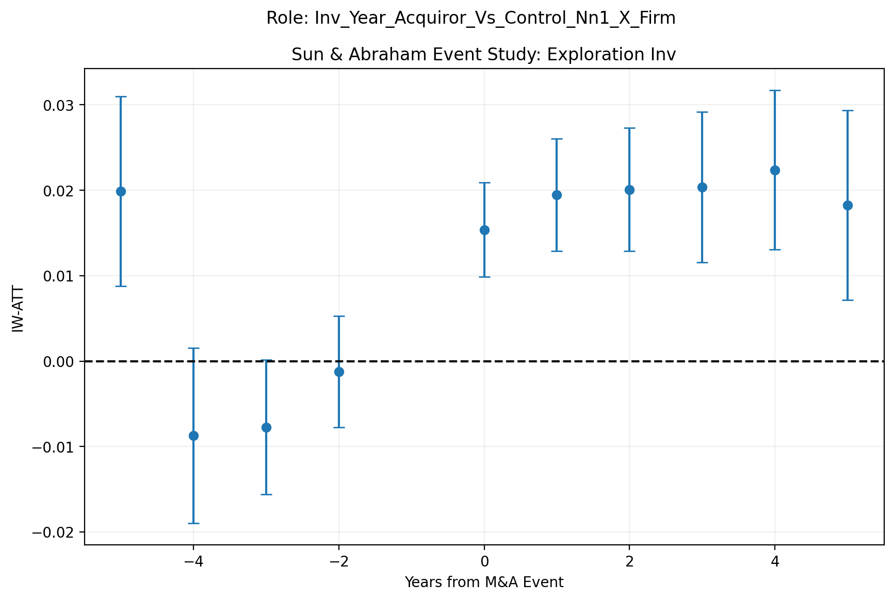


The CSDID results are more complicated.  Acquiror exploration is positive at event time `k=0` but turns negative in event years `k=1` to `k=3`.  Acquiror mobility also spikes at event time `k=0` and then becomes negative.  The CSDID results therefore do not cleanly reinforce the baseline story; instead, they show that the inferred dynamic patterns are estimator-sensitive.  It should be noted, however, that a negative CSDID estimate that differs from the Sun-Abraham result may partly reflect the greater support requirements and practical fragility of the CSDID estimator.  In this inventor-year setting, CSDID relies on identified cohort-time cells with valid not-yet-treated or never-treated controls, drops small or unsupported cells, uses a shorter event window, and then aggregates only the remaining $ATT(g,t)$ estimates.  As a result, a negative dynamic effect can be driven by a more selective and noisier subset of cohorts than the broader Sun-Abraham interaction-weighted estimate.

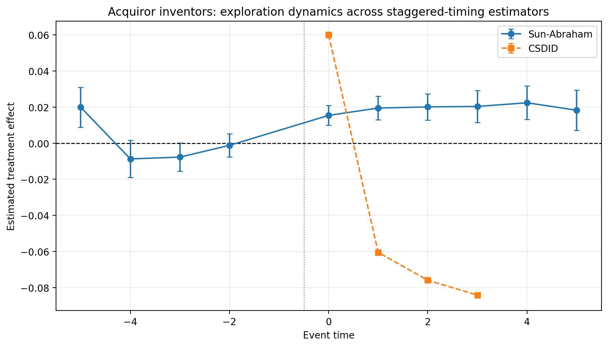


### 5. Heterogeneity in inventor-level results

The project also estimates triple-difference specifications asking whether M&A effects vary across inventor or firm types:

$$
Y_{it} = \beta_1\text{PostTreat}_{it} + \beta_2(\text{Post}_{it}\times Z_i)
       + \beta_3(\text{PostTreat}_{it}\times Z_i) + X_{it-1}'\delta + \alpha_i + \lambda_t + \varepsilon_{it}.
$$

Here $Z_i$ can be a measure of firm size, relative deal size, or an inventor's within-firm productivity.  The coefficient $\beta_3$ shows whether the treatment effect differs for units with characteristic $Z_i$.  The most interpretable inventor heterogeneity split is the within-firm inventor-rank measure, i.e., whether the inventor was ranked in the upper half of inventors working for the same firm at `t=-1`, based on cumulative innovation output.  For this binary heterogeneity variable, $\beta_1$ is the estimated post-treatment effect for the lower-rank group, while $\beta_1+\beta_3$ is the corresponding effect for the upper-rank group.


For acquiror inventors, the high-cumulative-patent interaction is negative for productivity and mobility outcomes but positive for exploration.  The baseline effect for lower-rank acquiror inventors is **+0.40 patents**, **+29.64 citation-weighted patents**, and **+2.0 percentage points in move-year incidence**.  The interaction for upper-rank inventors is **-0.48 patents**, **-23.28 citation-weighted patents**, and **-1.84 percentage points in move-year incidence**.  Thus, the implied effect for upper-rank acquiror inventors is much smaller: about **-0.08 patents**, **+6.36 citation-weighted patents**, and only **+0.16 percentage points in move-year incidence**.

This pattern suggests that the acquiror-side effects are concentrated among lower-rank inventors rather than among already-established inventors, as patenting, citations, and mobility increase more after treatment for less productive inventors.  However, the results should be interpreted with caution, as the following event-study plot for mobility shows.  In these heterogeneity event-study figures, the reference-group path reports the event-time coefficients for inventors with $Z_i=0$, while the upper-group path reports the combined effect for inventors with $Z_i=1$, i.e., the base event-time coefficient plus the interaction coefficient, $\beta_1+\beta_3$.

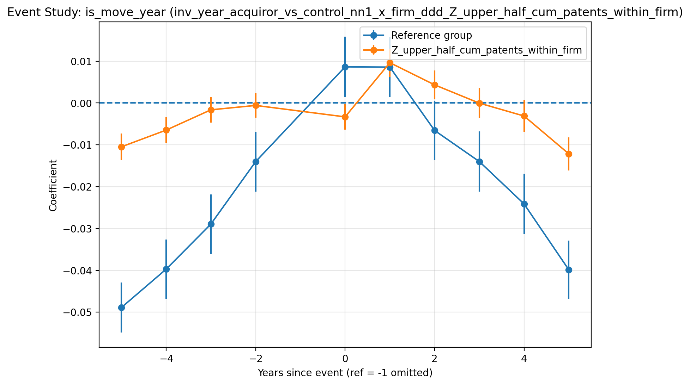

The mobility heterogeneity plot shows that the coefficients for the reference group have a strong positive slope in the pre-period, become positive and statistically significant at `t=0` and `t=1`, and then begin to fall again and turn negative.  The upper-half group is more stable, with treatment effects peaking at `t=1`. This suggests that mobility or reassignment is indeed concentrated among less established inventors in the reference group; however, the pre-period movement is substantial.  The effects should therefore be treated as mechanism exploration rather than as clean causal estimates.  In particular, the rising level of inventor mobility for the reference group in the pre-period could indicate a broader selection mechanism, in which younger or less productive inventors increasingly leave the firm before the merger.


The exploration result, on the other hand, appears more stable and points in a different direction than the productivity and mobility estimates: lower-rank acquiror inventors have an exploration effect of about **-2.2 percentage points**, while the upper-rank interaction is **+3.1 percentage points**, implying a small positive net exploration effect of roughly **+0.9 percentage points** for upper-rank inventors.  The results are also reflected in the event-study plot:  the high-rank group shows a steadily positive post-event exploration path, while the reference group declines after the event.  This suggests that more established inventors appear better positioned to redirect search after M&A, while the reference group of less productive inventors may face more disruption that limits exploration.  The caveat is that the pre-period is not perfectly parallel, especially for the reference group, which shows a slight positive pre-trend.  While this limits the degree to which the effects can be interpreted as standalone causal estimates, it supports the broader idea that the treatment effects of mergers are not uniform across inventors.

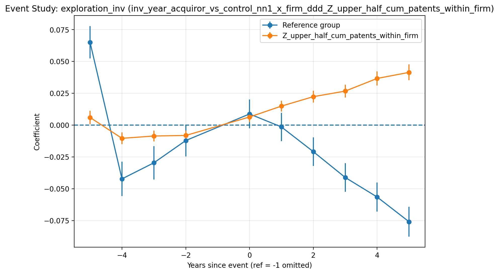


Finally, for target inventors, heterogeneity is harder to summarize as one clean mechanism, but the within-firm inventor-rank split again provides the most interpretable pattern.  For lower-rank target inventors, the baseline effects are **+0.75 patents** and **+35.88 citation-weighted patents**.  The upper-rank interactions are sharply negative: **-1.63 patents** and **-72.57 citation-weighted patents**, implying net effects for upper-rank target inventors of about **-0.88 patents** and **-36.70 citation-weighted patents**.  This suggests that, on the target side, any positive productivity response is concentrated among lower-rank inventors, while higher-rank target inventors experience weaker or negative post-treatment productivity effects.


### 6. Firm-level results 

The firm-level analysis tests whether the inventor-level effects aggregate into firm-level innovation outcomes.  This analysis uses role-specific acquiror and target panels, matches treated firms to non-M&A controls using pre-event firm size and industry information, and estimates the same fixed-effects DiD and event-study designs as used for the inventor-level analysis.  Overall, the results provide context and robustness for the inventor-level outcomes.

First, the program constructs cohort-specific stacked panels by matching treated firms at `t=−1` to same-SIC3 control firms that did not experience an M&A event within a ±5-year window using Mahalanobis distance on `log_sale` and `log_mv`.  This matching step before the actual empirical analysis matters, as shown by the matching balance figure below.  In the acquiror sample, treated firms are much larger before matching: the raw pre-match difference is **1.69 log sales** and **1.95 log market value**.  After matching to control firms, those gaps fall to **0.14 log sales** and **0.22 log market value**.  Target firms were already closer to controls on these size variables.  While this does not prove identification, it makes the parallel trends assumptions more plausible as the matching based on industry and pre-treatment size reduces the risk that any treatment effects are actually related to size-specific factors.

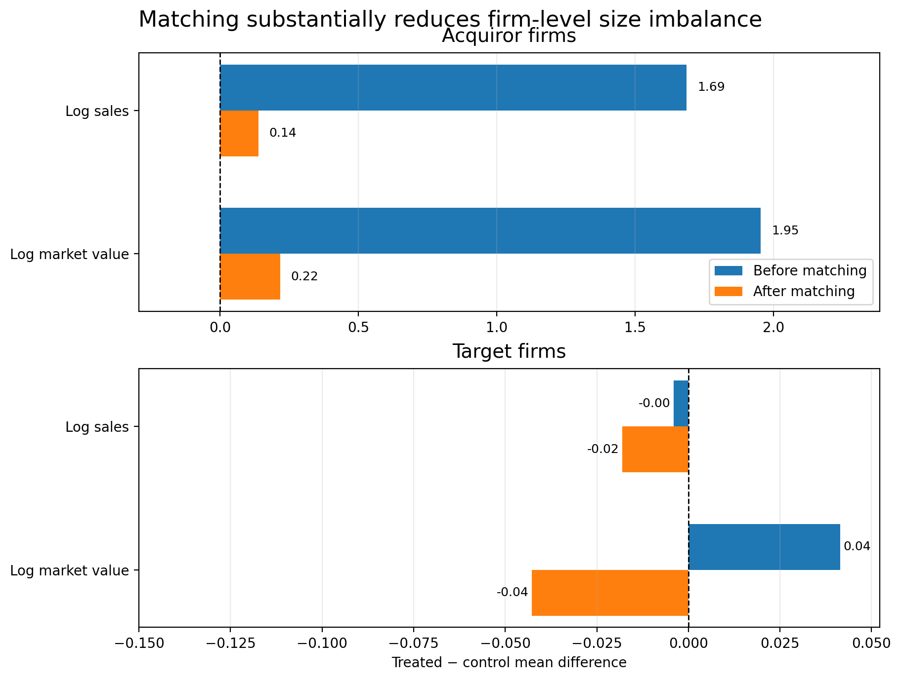


#### Baseline firm-level results and interpretation 

Before discussing the empirical results, note that outcomes in the firm-level panel are measured differently for interpretability and distributional reasons than in the inventor panel: firm-year innovation outcomes are often highly skewed aggregates of count variables across inventors, so most specifications use a log-transformation, $\log(1+y)$, to reduce the influence of extreme values and make coefficients closer to semi-elasticities, i.e., a coefficient $\beta$ can be interpreted approximately as a $100 \times \beta$% change in the outcome.  Inventor-year outcomes, on the other hand, are kept in original units so coefficients can be read as changes in patents, citations, exploration shares, or move-year probabilities per inventor-year.

The following figure summarizes the baseline DiD estimation results.  The firm-level baseline estimates show negative post-M&A effects for several aggregate acquiror outcomes, including the log number of patents, `log1p_total_patents` (**-0.058**, `p = 0.012`), the log aggregate KPSS patent-value measure, `log1p_xi_real` (**-0.122**, `p = 0.001`), and the log number of unique inventors, `log1p_num_inventors` (**-0.070**, `p = 0.004`).  Target firms show larger negative aggregate baseline effects, including `log1p_total_patents` (**-0.140**, `p < 0.001`), `log1p_cites` (**-0.370**, `p < 0.001`), and `log1p_num_inventors` (**-0.169**, `p < 0.001`).

The mostly negative but generally smaller point estimates for acquirors support the interpretation that firm-level innovation output and inventor counts weaken after M&A, while the inventor-year evidence points more specifically to reorientation, mobility, and heterogeneous inventor-level responses.  There is, however, not a one-to-one mapping between firm- and inventor-level outcomes as inventor-level outcomes can still be observed if an inventor moves to a different firm, while aggregate firm-level outcomes are tied to the patenting activity assigned to the original acquiror or target firm.  Furthermore, target firm-level outcomes are conditional on the target remaining observable after the merger, which makes the post-M&A target-firm panel especially selected.

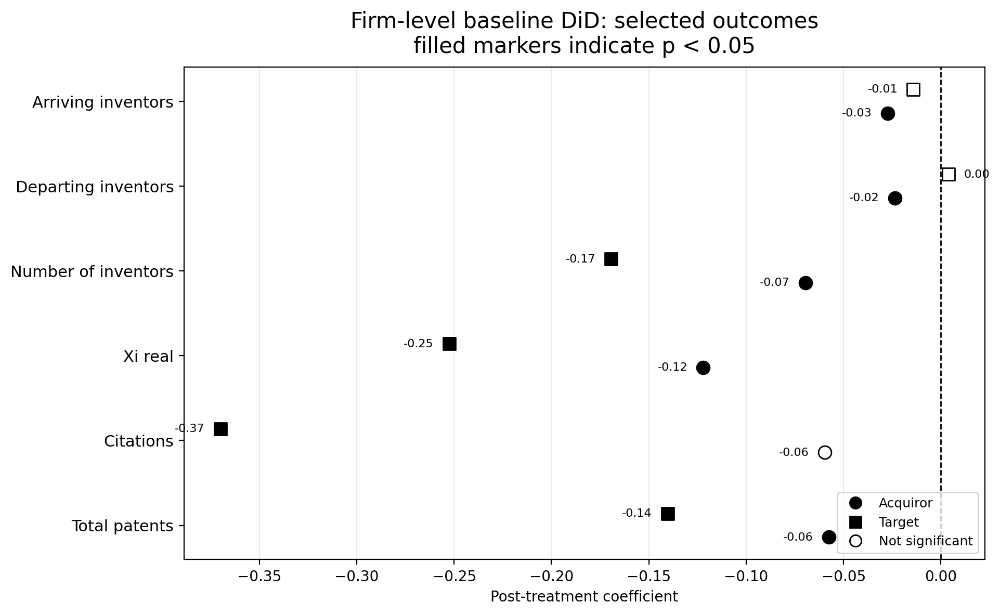


#### Event-study results for firm-level total patenting

While the baseline results generally support the main story, the event-study plots are not clean enough to make the firm-level effects the headline results.

Target-firm total patents show a strong positive pre-period path that falls toward zero around the event.  This is a severe pre-trend, which could indicate that firms with weakening innovation trajectories are more likely to become acquisition targets, or that target firms experience changes before the deal is announced in anticipation of the merger.  Econometrically, this is not a clean parallel-trends design.  Nevertheless, it provides useful context: the decline in innovation output for target inventors is also reflected at the aggregate firm level.  The earlier start of the firm-level decline is consistent with inventors leaving target firms before the merger or innovation activity being reorganized in anticipation of the merger.

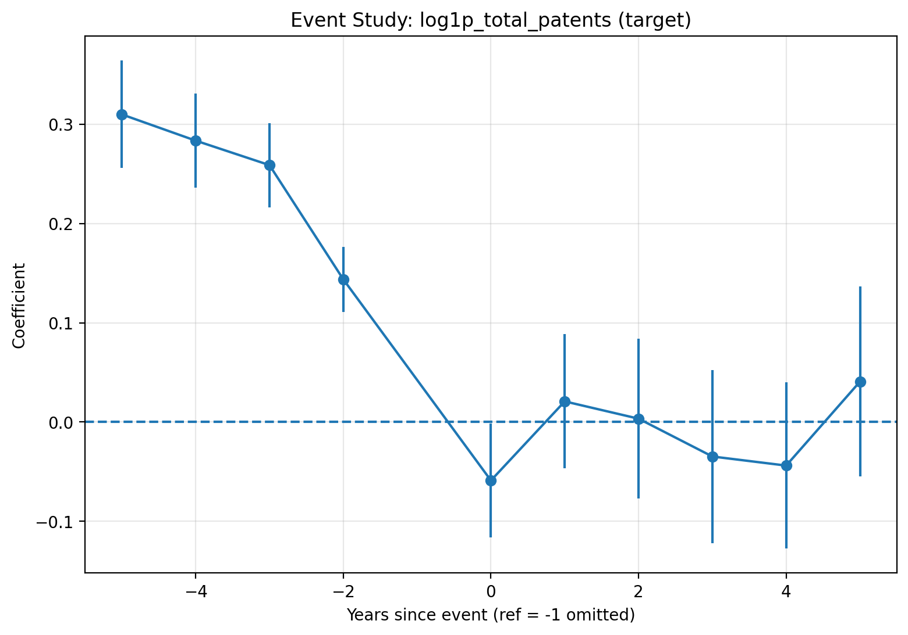


Acquiror-firm total patents also drift down before and after the event, though less sharply than for target firms, with wide error bands.  Consistent with the insignificant treatment effects for total patenting in the inventor-year panel, these patterns are informative because they suggest that treatment effects for acquiring firms and inventors are more likely to reflect changes in innovation direction than changes in total output.

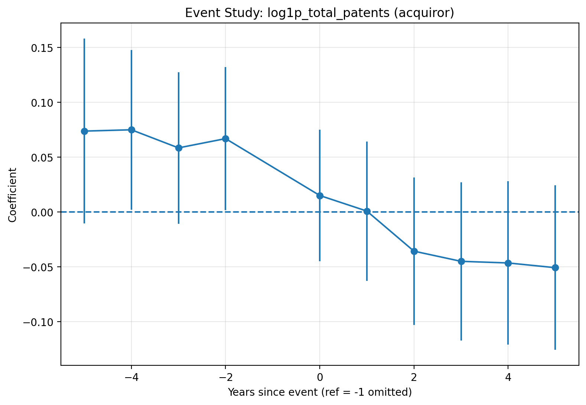


### 7. Additional advanced empirical methods for firm-level analysis

The additional advanced methods discussed below ask whether the main firm-level patenting pattern is visible for different empirical approaches.  However, they are best interpreted as robustness and diagnostic evidence.


#### BJS imputation

The [Borusyak, Jaravel, and Spiess (BJS)](https://academic.oup.com/restud/article/91/6/3253/7601390) imputation estimates what treated firms would have looked like absent treatment.  Thus, the advantage of this method is that treated firms are compared to an estimated untreated path, rather than only to control firms inside a two-way fixed-effects regression.  

Specifically, the untreated outcome model is estimated only on observations with $D_{it}=0$, i.e., control firms that were never treated and pre-period observations for treated firms:

$$
Y_{it}=\alpha_i+\lambda_t+X_{it}'\gamma+u_{it}, \qquad D_{it}=0,
$$

where $\alpha_i$ are firm fixed effects, $\lambda_t$ are year fixed effects, and $X_{it}$ are the same controls used in the firm-level analysis.  The fitted untreated potential outcome is

$$
\widehat{Y}_{it}(0)=\widehat{\alpha}_i+\widehat{\lambda}_t+X_{it}'\widehat{\gamma}.
$$

For treated post-event observations, the imputed treatment effect is

$$
\widehat{\tau}_{it}=Y_{it}-\widehat{Y}_{it}(0).
$$

Dynamic effects are then averaged by event time:

$$
\widehat{ATT}_k
=
\frac{1}{N_k}
\sum_{i,t:\,t-G_i=k,\,D_{it}=1}
\widehat{\tau}_{it}.
$$

Standard errors and confidence intervals are estimated using a bootstrap because the closed-form solution for the variance of the estimator is quite complex.  For the firm-level BJS results, the default inference routine uses a cluster bootstrap.  In each bootstrap draw, the code samples firm identifiers with replacement, keeps all observations for each sampled firm, re-estimates the untreated-outcome imputation model on the resampled data, recomputes the residualized treatment effects, and then re-averages those effects by event time.  The implementation also contains an alternative wild-bootstrap-style option that perturbs centered firm-level contributions without refitting the first-stage imputation model; this is mainly useful for larger panels where repeatedly refitting the model would be expensive.

For total patenting, the acquiror BJS path is negative after the event, with estimates of about **-0.28** at `k=0`, **-0.27** at `k=1`, and **-0.10** by `k=5`.  This is directionally consistent with decreased patenting after the merger, but the confidence intervals are wide and mostly include zero.  

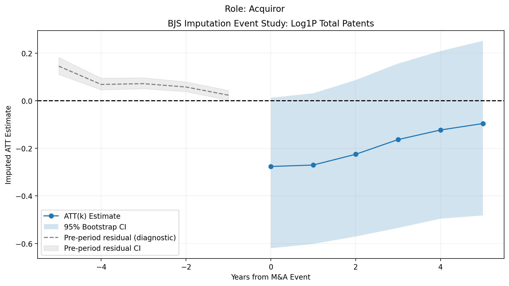


The target BJS path is less aligned with the main story: post-event estimates are positive.  This does not invalidate the project’s broader interpretation, but it is a useful warning that target firm-level patenting is sensitive to how the counterfactual path is constructed.  

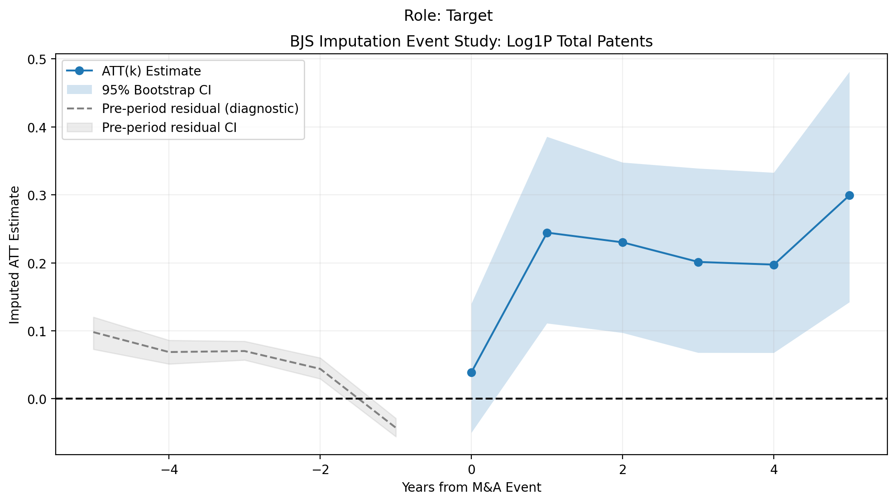


#### Synthetic control

The stacked synthetic-control estimator builds a firm-specific comparison path.  For each eligible treated firm, the method chooses donor weights $w_j$ for control firms so that the weighted donor path matches the treated firm’s pre-event outcome path:

$$
\widehat{Y}^{SC}_{it}
=
\widehat{\alpha}_i
+
\sum_{j\in\mathcal{D}_i}
\widehat{w}_{ij}Y_{jt},
\qquad
\widehat{w}_{ij}\geq 0.
$$

The treatment gap is the difference between the treated firm and its synthetic control unit:

$$
\widehat{\tau}^{SC}_{it}
=
Y_{it}
-
\widehat{Y}^{SC}_{it}.
$$

The stacked event-study path averages these firm-level gaps by relative year:

$$
\widehat{ATT}^{SC}_k
=
\frac{1}{N_k}
\sum_{i,t:\,t-G_i=k}
\left(Y_{it}-\widehat{Y}^{SC}_{it}\right).
$$

The project implementation uses a ridge-regularized nonnegative least-squares synthetic-control procedure.  It places more weight on pre-treatment years closer to the M&A event, estimates treated-minus-synthetic gaps, aggregates those gaps by event time, and bootstraps over treated firms to estimate confidence intervals, i.e., treated firms are resampled with replacement and the mean event-time gap is recomputed in each bootstrap draw.  This makes SCM useful by itself because it gives a visually intuitive counterfactual: if the synthetic-control design is credible, pre-event gaps should be close to zero, and post-event deviations show how treated firms diverge from similar donor-based paths.

For acquirors, 648 of 682 eligible treated firms have successful synthetic-control fits, and the average post-event effect for total patenting over `k\in[0,5]` is **-0.0695**, with a 95% confidence interval of **[-0.1219,-0.0124]**.  For targets, 115 of 144 eligible treated firms have successful fits, and the average post-event effect is **-0.1011**, with a 95% confidence interval of **[-0.1904,-0.0102]**.  In both cases, pre-event gaps are close to zero and post-event gaps turn negative.  This supports the general idea that treated firms patent less than comparable synthetic controls after M&A and that this effect is strongest for target firms.  However, the confidence interval widens substantially after the event, so the figure supports direction and intuition more than precise inference.

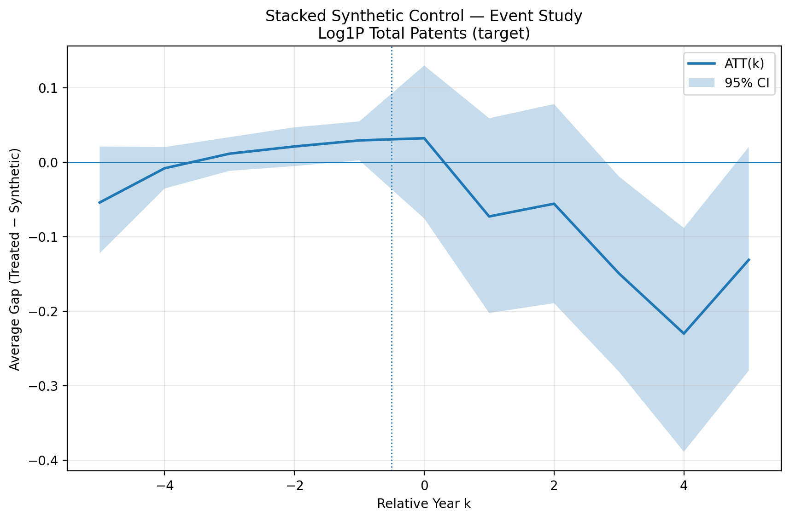


#### Causal forest

The causal forest is designed to study heterogeneity.  Average DiD effects can hide substantial variation across firms.  M&A events may reduce patenting for some firms, increase it for others, and have little effect for many.  Causal forest helps identify which pre-treatment characteristics are most associated with that variation.  

Specifically, the project converts the panel into a cross-sectional treatment-effect setting.  Pre-treatment covariates are measured at `k=-1` and the outcome is the average post-event outcome over a short window.  The objective is to estimate the conditional average treatment effect,

$$
\tau(x)
=
E\!\left[Y_i(1)-Y_i(0)\mid X_i=x\right],
$$

where $X_i$ are the pre-treatment firm covariates and $x$ is a particular covariate profile.

The project implements the causal forest using `CausalForestDML`.  Random forests are used as nuisance models for $E[Y_i\mid X_i]$ and $E[D_i\mid X_i]$, so the treatment-effect model is estimated after residualizing both the post-period outcome and the treatment indicator with respect to pre-period firm covariates.  The final forest estimates conditional treatment effects $\tau(X_i)$, reports their average as the ATE, computes an ATE confidence interval, saves firm-level CATEs, and reports feature importances that summarize which covariates are most important for explaining heterogeneous treatment effects.  

For log total patents, the causal-forest ATEs are not precise.  The acquiror ATE is **0.0879**, with a 95% confidence interval of **[-0.3803,0.5562]**.  The acquiror distribution is wider and has a longer positive tail.  The target ATE is **0.0120**, with a 95% confidence interval of **[-0.3780,0.4020]**, and is centered much closer to zero.  Thus, the intervals are too wide for a useful interpretation of ATE, but the distributions suggest that average firm-level effects hide substantial cross-firm dispersion.  

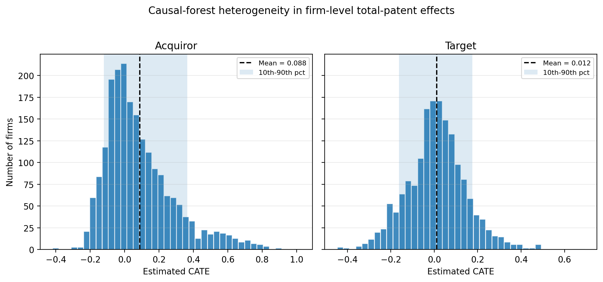

Note, however, that the causal-forest ATE is not directly comparable to the main DiD coefficient.  The main DiD estimate is a panel fixed-effects pre/post treatment effect: it uses within-firm changes around the M&A event relative to matched controls and absorbs firm and year fixed effects.  The causal forest instead is a cross-sectional heterogeneity exercise, using pre-period firm covariates and average post-period outcomes.  As a result, its ATE can be statistically insignificant even when the main DiD coefficient is significantly negative.  The most useful result is the heterogeneity ranking.  Lagged log sales is the most important heterogeneity variable for both acquirors and targets, suggesting that firm size is central to how patenting responds to M&A.   

The log-sales triple-DiD results are consistent with the causal-forest interpretation that firm size matters for treatment-effect heterogeneity.  A useful structured heterogeneity check is the target-firm Triple-DiD specification using three baseline log-sales bins in `t=-1`.  The specification can be written as

$$
Y_{it}
=
\beta \, \text{PostTreated}_{it}
+
\sum_{m=1}^{2}
\delta_m \left(\text{Post}_{it}\times Z_{im}\right)
+
\sum_{m=1}^{2}
\theta_m \left(\text{PostTreated}_{it}\times Z_{im}\right)
+
X_{it}'\gamma
+
\alpha_i
+
\lambda_t
+
\varepsilon_{it},
$$

where $Z_{im}$ are indicators for the middle and largest baseline log-sales terciles, with the smallest tercile omitted.  The coefficient $\beta$ therefore gives the post-M&A effect for the smallest target firms, while $\theta_m$ measures how much the treatment effect differs for larger target firms relative to that smallest-size group.

For log total patents, the smallest target firms have a negative post-M&A effect of **-0.104** (**p=0.022**).  The interaction for the largest size tercile is also negative and statistically significant: **$\theta_2$=-0.145** (**p=0.049**).  This means that the estimated post-M&A patenting effect for the largest target firms is approximately **-0.104 - 0.145 = -0.249.**  This suggests that target-side patenting declines are stronger among larger targets, consistent with the causal-forest result that lagged log sales is the most important heterogeneity variable.  However, this is still only supporting evidence rather than a headline result, because it is one heterogeneity specification and the pattern is not equally strong across all size-bin definitions.


#### Placebos and diagnostics

The placebo routines test whether the empirical design produces significant effects when treatment timing should not have a causal interpretation.  Here, $G_i$ is the true M&A event year for treated firm $i$.  In the true design, the post-treatment indicator turns on in and after the actual event year:

$$
D_{it}=1\{t\geq G_i\}.
$$

The lead placebo instead assigns the same firm a fake treatment year that occurs $L$ years before the true deal:

$$
G_i^{lead}=G_i-L,
\qquad
D_{it}^{lead}=1\{t\geq G_i^{lead}\}.
$$

For example, if a firm is actually acquired in 2005 and $L=3$, the placebo treatment year is 2002.  The placebo regression then asks whether the model already finds an “effect” before the actual M&A event.  A strong placebo effect would suggest that the treated firms were already on a different trajectory before treatment.

The permutation placebo keeps the set of treatment years but randomly reallocates them across treated firms:

$$
G_i^{perm}=\pi(G_i),
\qquad
D_{it}^{perm}=1\{t\geq G_i^{perm}\}.
$$

Here, $\pi(G_i)$ denotes a random permutation of the actual cohort years.  This preserves the overall distribution of treatment timing but breaks the link between a specific firm and its actual M&A year.  The placebo regression then asks whether similar effects appear when treatment timing is artificially reassigned.  If the true estimates are stronger and more economically coherent than the permuted estimates, this would support the interpretation that the main results are connected to actual M&A timing rather than generic time patterns or features of the model specification.

Overall, the tests probe whether estimated effects are mechanically produced by the model, by persistent pre-trends, or by timing artifacts.  Thus, they should be seen as design diagnostics.  In the project implementation, placebo timing is fed back through the same baseline and advanced routines, including DiD/event-study, Sun-Abraham, and BJS versions for significant firm-level outcomes.  For the patenting results, the placebo evidence is mixed.  The target lead-placebo results are generally closer to zero, especially in the baseline and Sun-Abraham specifications, which is reassuring, although the target permutation and BJS placebo results are not completely flat.  The acquiror placebo results are less clean: the baseline lead and permutation placebo estimates are positive and statistically significant, and the Sun-Abraham lead placebo also shows a positive longer-horizon placebo estimate, even though the Sun-Abraham permutation placebo is not significant.  Thus, the placebo evidence supports treating the firm-level patenting results as useful context rather than as the cleanest headline evidence.

### 8. Interpretation of the full evidence

The most coherent economic interpretation of the results is that M&A changes innovation performance and direction, but the strength of the evidence differs across roles and outcomes.  

For **acquirors**, the inventor-level evidence points to reorientation.  Exploration increases in the post-event period in both the baseline event study and Sun-Abraham plot.  The mobility plot suggests a short-run reallocation spike after a merger rather than a persistent increase in mobility.  The visual evidence is not perfectly clean because several acquiror paths move before the treatment year, but the repeated pattern across search-direction and heterogeneity results makes acquiror reorientation the best-supported mechanism.

For **targets**, the evidence points more toward disruption and potential selection.  Target inventor patenting falls sharply in later post-event years, and target firm-level baseline estimates are negative.  But the target event studies show substantial pre-period movement.  This means that target results are economically severe but dynamically less clean: acquired targets appear to be on different innovation trajectories even before the acquisition, which could contribute to them being acquired in the first place.

The evidence at the aggregate firm level is contextual.  Firm-level event studies show pre-trends and wide error bands, while SCM and BJS provide mixed but useful robustness diagnostics supporting the general story from the inventor-level analysis.  These aggregate plots show that M&A can depress patenting at the firm level even when inventor-level mechanisms are more nuanced.  

